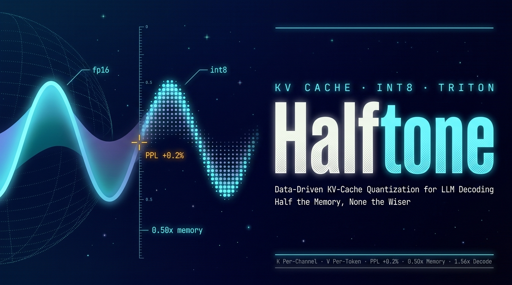

<!-- PROJECT LOGO -->
<div align="center">
  <a href="https://github.com/ChaoyuWang04/Halftone_QuantizedKVCache">
    
  </a>

<h3 align="center">Halftone</h3>

<p align="center">
  Data-driven INT8 KV-cache quantization for LLM decoding — SQNR profiling of real K/V distributions to select granularity, a physically int8-backed HF cache with near-lossless perplexity (+0.2%), and hand-written fused Triton kernels for quantize-on-write and flash-style int8 decode attention, reaching 1.56× of the 2× bandwidth ceiling with the gap fully attributed to occupancy.
  <br /><br />
  | <a href="https://github.com/ChaoyuWang04/AdCampaignAgent-SFT/issues/new?labels=bug&template=bug-report---.md">Report Bug</a> |
  <a href="https://github.com/ChaoyuWang04/AdCampaignAgent-SFT/issues/new?labels=enhancement&template=feature-request---.md">Request Feature</a> |
</p>

</div>

## About

Halftone quantizes the KV cache of Qwen3-0.6B to INT8 the way halftone printing renders photographs: **half the ink, indistinguishable from a distance**. Every design decision is driven by measured distributions rather than convention, and every performance number comes with an explanation of its distance from the theoretical ceiling.

| Dimension | Result |
|---|---|
| Perplexity (KV int8, q fp16) | 24.68 → 24.73, **1.002×** |
| Perplexity (q+K+V all int8) | 24.68 → 24.98, **1.012×** |
| Cache memory (int8 / fp16) | **0.538×** short-context, → **0.50×** as context grows |
| Decode attention (S=4096) | int8 vs fp16 kernel **1.56×** (theoretical ceiling 2×) |

Chosen scheme, selected by data: **K per-channel · V per-token · symmetric int8**.

Why this works at all: decode-time attention is deeply **memory-bound** — at 1000 tokens the KV cache read costs ~63 μs of bandwidth while the attention math itself needs ~1 μs of compute. INT8 halves the bytes, dequantization is effectively free, and the dividend grows with context length.

Environment: RTX 5090 (sm_120) · CUDA 13 · PyTorch 2.11 · Triton 3.6 · `uv`

## Step 1 — Let the Data Choose the Granularity

Real K/V tensors are captured from live prefill runs (8 diverse prompts), then scored by SQNR under every granularity (each +6 dB ≈ one extra effective bit):

| Granularity | K SQNR (dB) | V SQNR (dB) |
|---|---|---|
| per-tensor | 29.18 | 31.51 |
| per-head | 31.14 | 34.38 |
| per-token | 35.64 | **42.04** |
| per-channel | **46.17** | 41.49 |

- **K → per-channel**: leads per-token by +10.5 dB, far beyond the run-to-run std — K's outliers concentrate along channels (13.6× concentration)
- **V → per-token**: leads by only +0.54 dB, within noise, but V's variation lives on the token axis
- Skew ≈ 0.01 on both → distributions are symmetric, so **symmetric int8 suffices**

This independently reproduces the KIVI consensus (K per-channel, V per-token) — with the measurements to defend it. The underlying first principle: int8 has 255 rungs and the group maximum sets the ruler's range, so **cut the scale along the axis where outliers cluster**.

There is also a duality worth knowing: QKᵀ sums over channels and PV sums over tokens — each cache's accuracy-optimal scale axis lands exactly on its own reduction axis, so the scales cannot be factored out of the matmul. That is why this project (and KIVI) must dequantize-then-multiply.

## Step 2 — The Layer-0 Detective Case

The int8 reference implementation matched fp16 beautifully on middle and late layers (0.6–1.5% error) but blew up to **25.9% on layer 0**. The obvious hypothesis — "layer 0 has token outliers, the classic attention sink" — was **falsified by the diagnosis**:

- Layer 0's K is actually the most extreme *channel*-outlier layer in the model (concentration 91.9) — per-channel is exactly right for it
- No token stood out at all (max 1.4× median)
- Isolation testing (quantize only q / only K / only V) pinned the real culprit: **q — which was synthetic random data**, because a KV cache, by definition, stores no q

With real q from the model, layer-0 error dropped from 25.9% to **2.55%**. Two disciplines survived intact: anomalous data means *find the bug*, never *lower the bar*; and a falsifiable diagnosis script catches the truth even when the initial hypothesis is wrong.

## Step 3 — Physical INT8 Cache on the Real Model

`QuantizedKVCache` subclasses HF's `DynamicCache` and **stores K/V physically as int8**, dequantizing on read; a monkeypatched attention forward runs the real model end-to-end.

- PPL: KV-only **1.002×**, q+K+V **1.012×** — near-lossless
- q granularity A/B on the real model (per-tensor / per-token / per-channel): all within 1% — **q granularity is not a meaningful lever**, and since q never enters the cache, quantizing it buys nothing on the dequant-then-matmul path
- Measured cache ratio 0.538× short-context; the fixed per-channel K-scale overhead amortizes toward 0.50× with length

## Kernels — Where the Bandwidth Dividend Gets Real

**Quantize-on-write (fused findmax + quant + store).** V per-token holds a steady **2.8–3.3×** over the unfused path; K per-channel *degrades to 0.45×* at S=4096. The autopsy is a textbook coalescing lesson: the K kernel reduces along the strided S axis, adjacent threads touch addresses 256 B apart, and ~16× of bandwidth is wasted — invisible at small S under launch overhead, brutal at large S. Rule burned in: **always stream along the contiguous dimension; tile 2D so the innermost axis stays contiguous.**

**INT8 decode attention (flash-style online softmax; int8 loads, register dequant, fp32 math).** Correctness 0.02%. Speedup vs the fp16 twin: 0.87× at S=64 → 1.50× at S=512 → **1.56× at S=4096**.

The missing 0.44× is not hand-waved: the grid is only batch(1) × heads(16) = 16 programs against ~170 SMs, so effective bandwidth sits below 5% of peak — the kernel is **occupancy-bound, not bandwidth-bound**, and a back-solved fixed cost R ≈ 47 μs (fp32 softmax work that int8 does not shrink) dilutes 2× into exactly the observed 1.56×. Flash-Decoding-style split-K is the known cure (see roadmap).

## Repository Layout

```text
Halftone/
├── src/
│   ├── analysis_kvcache/     # real K/V capture from prefill + SQNR granularity analysis
│   ├── kernels/              # fused Triton: quantize-on-write + int8 decode attention
│   └── integration/          # QuantizedKVCache (HF DynamicCache subclass) + attention patch
├── reference/                # fp16 / int8-pytorch decode attention, SDPA-validated ground truth
├── tests/                    # real-model PPL runs, layer-0 diagnosis, cache + q-granularity A/B
├── data/                     # captured distributions + SQNR report
└── ForChaoyu.md              # first-person project retrospective (Chinese)
```

## Requirements

- Python 3.13+ · `uv`
- CUDA-matched PyTorch build (sm_120 needs a cu-matched wheel) + Triton 3.6+
- `transformers` + `accelerate`; Qwen3-0.6B downloads on first run (~1.5 GB)

## Setup

```sh
git clone https://github.com/ChaoyuWang04/Halftone_QuantizedKVCache.git
cd QuantizedKVCache
uv venv
# install a CUDA-matched torch wheel first, then:
uv pip install -e .
```

## Usage

```sh
# Step 1 — capture real K/V from prefill, then score every quantization granularity
python src/analysis_kvcache/collect_kvcache_distribution.py
python src/analysis_kvcache/analyze_distribution.py

# Step 2/3 — real-model PPL with int8 KV (monkeypatched attention)
python tests/qwen_kvcache_test.py

# layer-0 anomaly diagnosis (only-q / only-K / only-V isolation)
python tests/diagnose_layer0.py

# Phase A — physical int8 cache + q-granularity A/B
python tests/qwen_kvcache_full.py

# Phase B/C — fused Triton kernels: quantize-on-write, int8 decode attention
python src/kernels/quant_kv_triton.py
python src/kernels/int8_decode_attn_triton.py
```

## Roadmap

- [x] SQNR-driven granularity selection on real distributions (K per-channel, V per-token, symmetric)
- [x] Physical int8 `DynamicCache` + near-lossless PPL on the real model (1.002×)
- [x] Fused quantize-on-write Triton kernel (V 2.8–3.3×; K coalescing pathology diagnosed)
- [x] Fused int8 flash-style decode attention (1.56×, gap fully attributed to occupancy)
- [ ] Flash-Decoding / split-K: parallelize over S to fill ~170 SMs and close in on 2×
- [ ] Batched benchmark: does batch=32 alone lift occupancy enough?
- [ ] Fix the K-quant kernel with 2D tiling (or transpose-first) for coalesced reduction
- [ ] Static quantization from calibration distributions — drop the per-step findmax
- [ ] Block-wise per-channel K, the production-PagedAttention answer to single-token decode
- [ ] INT8 tensor-core prefill kernel — prefill is compute-bound, where int8 matmul actually pays
- [ ] Scale validation: Qwen3-4B/7B, task benchmarks beyond PPL, and the int4 trade-off frontier

## Contributing

Issues and pull requests are welcome. The highest-leverage areas:
- split-K / Flash-Decoding implementations of the int8 decode kernel
- SQNR distribution reports from other model families
- int4 and mixed-precision granularity studies

## Links

- Project: [https://github.com/ChaoyuWang04/Halftone_QuantizedKVCache](https://github.com/ChaoyuWang04/Halftone_QuantizedKVCache)
- Author: [Chaoyu Wang](https://www.linkedin.com/in/samwang04/)

## License

Distributed under the MIT License. See `LICENSE` for more information.
